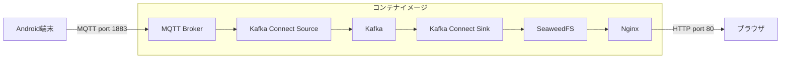

# Android センサーダッシュボード

Android端末のセンサーデータを収集・蓄積・可視化するためのバックエンドシステムを、
単一のDockerコンテナイメージとして提供します。

## 概要

Android端末上のセンサー読取値をMQTTブローカー経由で受信し、
Kafka Connectによりオブジェクトストレージ（SeaweedFS）に蓄積します。
蓄積されたデータはウェブブラウザからグラフとして閲覧できます。



MQTTトピック名は `sensor-data` 固定です。

## コンテナイメージ

### イメージの取得

コンテナイメージはHarborレジストリで公開されています。

```
harbor.vcloud.nii.ac.jp/sinetstream/android-tutorial
```

### Docker Compose による起動

`compose.yaml` を使用して起動できます。

```console
$ docker compose up -d
```

### docker run による起動

```console
$ docker run -d --name broker \
    -p 1883:1883 \
    -p 80:80 \
    harbor.vcloud.nii.ac.jp/sinetstream/android-tutorial:latest
```

### 公開ポート

| ポート | プロトコル | 用途 |
|--------|------------|------|
| 1883 | MQTT | Android端末からのセンサーデータ受信 |
| 80 | HTTP | グラフ表示用ウェブUI |

### 対応プラットフォーム

- `linux/amd64`
- `linux/arm64`

## コンテナの停止・再起動

```console
# 停止
$ docker compose stop

# 再起動
$ docker compose restart

# コンテナの破棄
$ docker compose down
```

## コンテナイメージのビルド

ビルドには [Docker Buildx](https://docs.docker.com/buildx/working-with-buildx/) を使用します。
ビルド定義は `docker-bake.hcl` に記述されています。

```console
$ docker buildx bake
```

### コンテナの構成要素

| コンポーネント | 説明 |
|----------------|------|
| MQTT ブローカー (Mosquitto) | Android端末からのメッセージ受信 |
| Kafka (KRaft) | メッセージのストリーム処理 |
| Kafka Connect | MQTT→Kafka、Kafka→S3 のコネクタ |
| SeaweedFS | S3互換オブジェクトストレージ |
| Nginx | ウェブUIの配信およびSeaweedFSへのリバースプロキシ |
| Chart UI (Svelte) | センサーデータのグラフ表示 |

## ディレクトリ構成

```
├── Dockerfile              # コンテナイメージのビルド定義
├── docker-bake.hcl         # Docker Buildx Bake 設定
├── compose.yaml            # Docker Compose 設定
├── LICENSE                 # Apache License 2.0 + サードパーティライセンス
├── NOTICE                  # 著作権および帰属表示
├── components/
│   ├── converter/          # Kafka Connect用カスタムコンバータ (Java/Gradle)
│   └── chart/              # センサーデータ可視化UI (Svelte/TypeScript)
├── scripts/
│   ├── start-kafka-connect.sh
│   ├── setup-kafka-connect.sh
│   └── setup-seaweedfs.sh
└── etc/
    ├── nginx/              # Nginx 設定
    └── supervisord.d/      # supervisord サービス定義
```

## 前提条件

- Docker Engine が導入済みであること
- Android端末とバックエンドシステムがIPネットワークで接続可能であること

## ライセンス

本プロジェクトは [Apache License 2.0](LICENSE) の下で公開されています。

コンテナイメージには以下のサードパーティソフトウェアが含まれます。
詳細は [LICENSE](LICENSE) ファイルの THIRD-PARTY LICENSES セクションを参照してください。

| ソフトウェア | ライセンス |
|-------------|-----------|
| Eclipse Mosquitto | Eclipse Public License 2.0 |
| Apache Kafka, Avro | Apache License 2.0 |
| OpenJDK | GPL 2.0 with Classpath Exception |
| Kafka Connect MQTT (Stream Reactor) | Apache License 2.0 |
| SeaweedFS | Apache License 2.0 |
| Confluent Kafka Connect S3 | Confluent Community License |
| Confluent Schema Registry 関連ライブラリ | Apache License 2.0 |
| Nginx | BSD 2-Clause |
| Jackson, Guava, Commons 他 Java ライブラリ | Apache License 2.0 |
| Chart.js, Svelte, date-fns, Beer CSS 他 | MIT |
| lru-cache | Blue Oak Model License 1.0.0 |
